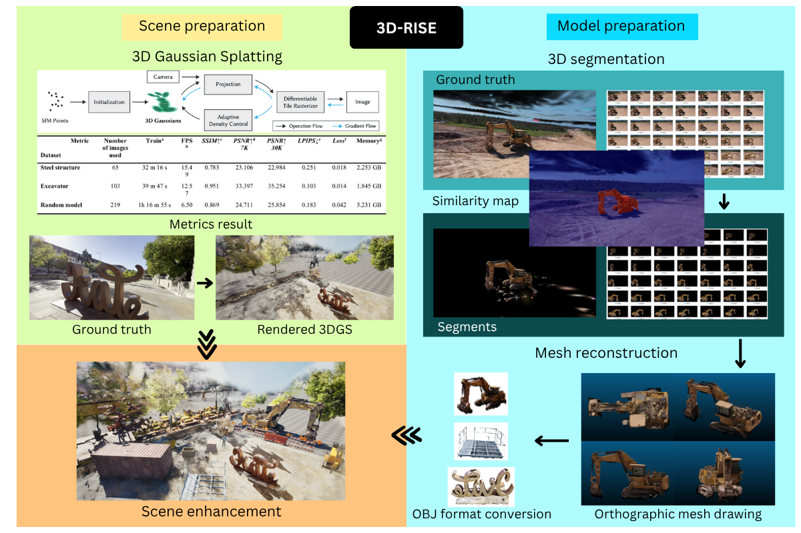
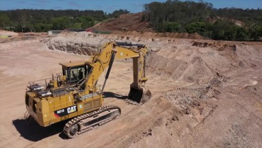
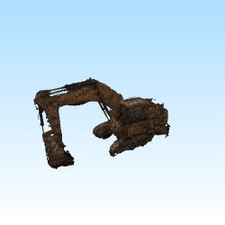

# 3D-RISE
[ELSP2025] 3D Reconstruction, Integration, Segmentation, and Editing (3D-RISE) to revolutionize construction site simulations.
| [Paper](https://www.elspub.com/papers/j/1893818303650844672) |

<p align="center">

</p>

The 3D-RISE workflow is designed to revolutionize construction site simulations by enabling high-quality, editable 3D environments for construction site layout planning and simulation training.

This project utilizes 3D Gaussian Splatting (3DGS) as the core reconstruction technique, transforming captured image datasets into realistic and computationally efficient 3D scenes.

To enhance and customize these reconstructions, 3D-RISE integrates these powerful open-source repositories:

- [SAGA (Segment Any 3D GAussians)](https://github.com/Jumpat/SegAnyGAussians)
- [SuGaR (Surface-Aligned Gaussian Splatting)](https://github.com/Anttwo/SuGaR/tree/main?tab=readme-ov-file)
- [XScene-UEPlugin (Unreal Engine 5 3DGS plugins)](https://github.com/xverse-engine/XScene-UEPlugin)

By combining these tools, 3D-RISE allows the generation of customizable 3D construction sites where individual components can be segmented, refined and reused for simulation workflows. The outcome is a pipeline that bridges raw 3D reconstruction and practical applications in the Architecture, Engineering, and Construction (AEC) industry.

## BibteX

If you find this project helpful for your research, pleasure consider citing the report and giving a ⭐.
```
@article{Chai2025_SC_0019,
  author  = {Chai, P. and Hou, L. and Lo, X. and Zhang, G. and Chen, H. and others},
  title   = {Revolutionising construction site simulations with automated 3D segmentation and mesh construction},
  journal = {Smart Construction},
  year    = {2025},
  doi     = {10.55092/sc20250019},
  url     = {https://doi.org/10.55092/sc20250019}
}
```

## Acknowledgement

The implementation of 3D-RISE heavily refers to [Gaussian Splatting](https://github.com/graphdeco-inria/gaussian-splatting), [SAGA](https://github.com/Jumpat/SegAnyGAussians), [SuGaR](https://github.com/Anttwo/SuGaR), [XScene-UEPlugin](https://github.com/xverse-engine/XScene-UEPlugin) and we sincerely thank them for their contributions in making this research project successful. We also gratefully acknowledge computational resource grants through [RMIT AWS Supercomputing Hub (RACE HUB)](https://www.rmit.edu.au/partner/hubs/race).

## Requirements

Ran in Ubuntu 22.04.

The software requirements are the following:

- Conda (recommended for easy setups)
- C++ Compiler for PyTorch extensions
- CUDA toolkit 11.8 for PyTorch extensions
- C++ Compiler and CUDA SDK must be compatible
- FFMPEG for frames extractions from video datasets
- COLMAP for camera poses estimation from images

Please refer to the original [3D Gaussian Splatting repository](https://github.com/graphdeco-inria/gaussian-splatting) for more details about requirements.

## Installation

Start by cloning this repository:
```bash
git clone https://github.com/ClanPing/3D-RISE.git
```

Then fetch required submodules:
```bash
cd 3D-RISE
git submodule update --init -- SuGaR SAGA third_party/kmeans_pytorch third_party/segment-anything
```

Next, install the dependencies:
```bash
conda env create -f environment.yml
conda activate 3drise
```

## Prepare data

`datasets` folder contains excavator, sign, structure to be used in this project. You can also use your own custom dataset.

To convert a video to images, make sure to install `ffmpeg` and run the following command:
```bash
# Install ffmpeg
sudo apt upate
sudo apt install -y ffmpeg

# Execute command
ffmpeg -i <Path to the video file> -qscale:v 1 -qmin 1 -vf fps=<FPS> %04d.jpg
```
where `<FPS>` is the desired sampling rate of the video images. An FPS value of 1 corresponds to sampling one image per second. We recommend to adjust the sampling rate to the length of the video, so that the number of sampled images is between 100 and 300.

Dataset structure below is required for COLMAP camera poses estimation:
```
<location>
|---input
	|---<image 0>
	|---<image 1>
	|---...
|---<path to the video file>
```

Make sure to install `colmap` and run:
```bash
# Install colmap
sudo apt update
sudo apt install -y colmap

# Execute command
python convert.py -s <location>
```

The expected dataset structure is as follows:
```
<location>
|---images
|   |---<image 0>
|   |---<image 1>
|   |---...
|---sparse
    |---0
        |---cameras.bin
        |---images.bin
        |---points3D.bin
|---run-colmap-geometric.sh
|---run-colmap-photometric.sh
|---<path to the video file>
```

## 3D segmentation + Mesh reconstruction

<p align="center">
  
  &nbsp;&nbsp;&nbsp;&nbsp;
  
</p>

### 3D segmentation

```bash
cd <SAGA directory>
```

Please refer to the original [SAGA repository](https://github.com/Jumpat/SegAnyGAussians) for more detailed instructions.

1) Train Gaussian Splatting:
```bash
python train_scene.py -s <path to COLMAP or NeRF Synthetic dataset>

# OPTIONAL: evaluation
python train.py -s <path to COLMAP or NeRF Synthetic dataset> --eval # Train with train/test split
python render.py -m <path to trained model> # Generate renderings
python metrics.py -m <path to trained model> # Compute error metrics on renderings
```

Download the pretrained [public ViT-H model](https://dl.fbaipublicfiles.com/segment_anything/sam_vit_h_4b8939.pth) for Segment Anything Model (SAM). The downloaded model path will be referred as `<path to the pre-trained SAM model>`.

2) Obtain masks segmentation and scales:
```bash
python extract_segment_everything_masks.py --image_root <path to COLMAP or NeRF Synthetic dataset> --sam_checkpoint_path <path to the pre-trained SAM model> --downsample <1/2/4/8>
python get_scale.py --image_root <path to COLMAP or NeRF Synthetic dataset> --model_path <path to trained model>
```
Note that sometimes the downsample is essential due to the limited GPU memory.

3) Train 3D Gaussian affinity features:
```bash
python train_contrastive_feature.py -m <path to trained model> --iterations 10000 --num_sampled_rays 1000
```

4) GUI usage:
```bash
python saga_gui.py --model_path <path to trained model>
```
After selecting the interest target(s), you can click `segment 3D` to get the 3D segmentation results preview. Select `save as` to save the segmentation results in `./segmentation_res/model_name.pt`.

5) Rendering:
```bash
python render.py -m <path to trained model> --precomputed_mask <path to the segmentation results> --target scene --segment
```
Retrain camera poses estimation for your new segmentation datasets before proceeding towards mesh reconstruction.

### Mesh reconstruction

If you do not want to perform segmentation, you can skip directly to this step.

```bash
cd <SuGaR directory>
```

Please refer to the original [SuGaR repository](https://github.com/Anttwo/SuGaR) for more detailed instructions.

You can run the following single script to optimize a full SuGaR model from scratch using a COLMAP dataset:
```bash
python train_full_pipeline.py -s <path to full/segmented COLMAP dataset> -r <"dn_consistency", "density" or "sdf"> --high_poly True --refinement_time <"short", "medium", "long"> --export_obj True
```

OR

<details>
<summary><span style="font-weight: bold;">Run it one by one as follows to check each progress output. Click here for details.</span></summary>

1) Train Gaussian Splatting:
```bash
python train_scene.py -s <path to COLMAP or NeRF Synthetic dataset>
```

2) Optimize coarse SuGaR:
```bash
python train_coarse_density.py -s <path to COLMAP or NeRF Synthetic dataset> -c <path to trained model>
```

3) Extract mesh from coarse SuGaR:
```bash
python extract_mesh.py -s <path to COLMAP or NeRF Synthetic dataset> -c <path to trained model> -m <path to coarse sugar output.pt>
```

4) Refine SuGaR:
```bash
python train_refined.py -s <path to COLMAP or NeRF Synthetic dataset> -c <path to trained model> -m <path to coarse mesh sugar output.ply>
```

5) Extract mesh and texture from refined SuGaR:
```bash
python extract_refined_mesh_with_texture.py -s <path to COLMAP or NeRF Synthetic dataset> -c <path to output 3DGS model> -m <path to refined sugar output.pt>
```
Results would appear in `./refined_ply` folder containing `.PNG`, `.MTL`, `.OBJ` file.

</details>

For evaluation, create a `.json` config file containing the paths to the scenes in the following format: `{source_images_dir_path: vanilla_gaussian_splatting_checkpoint_path}`. Then run the script as follows:
```bash
python metrics.py --scene_config <Path to the .json file> -r <"sdf" or "density"> 
```
Results are saved in a `.json` file in the `output/metrics/` directory.

## Visualization

3d visualization software such as Blender, CloudCompare can be used to visualize the results. We used Unreal Engine 5 to load and combine the processed models and scenes inside. The plugin for importing 3DGS rendered scene can be found [here](https://github.com/xverse-engine/XScene-UEPlugin).

